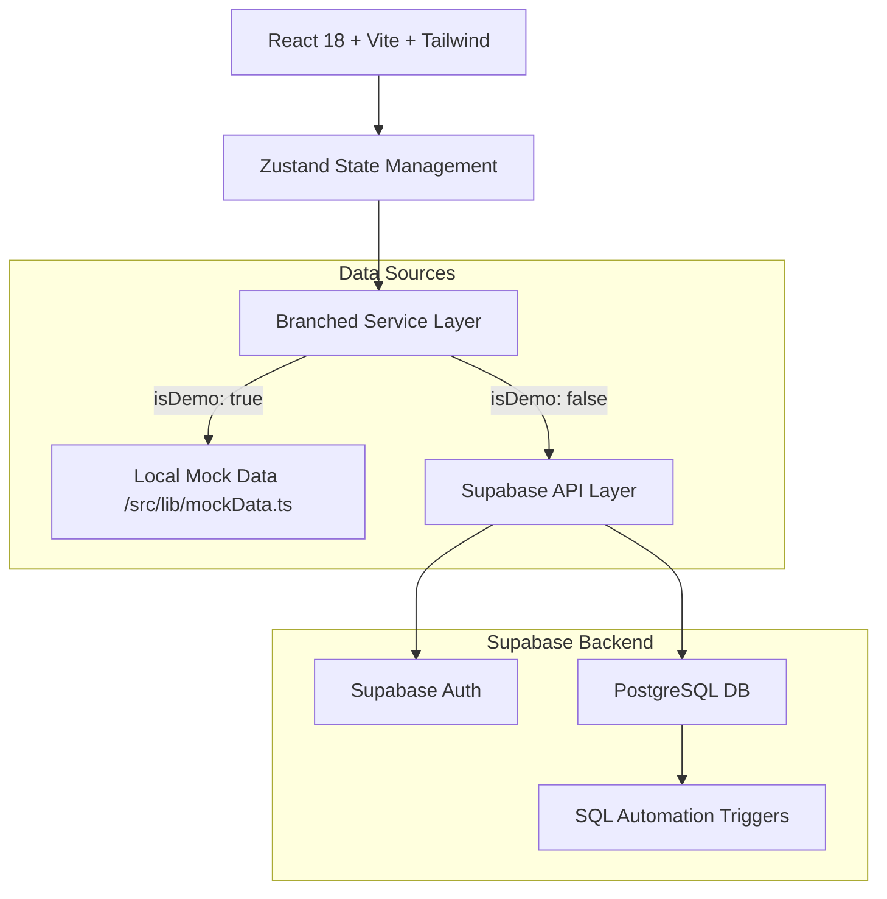
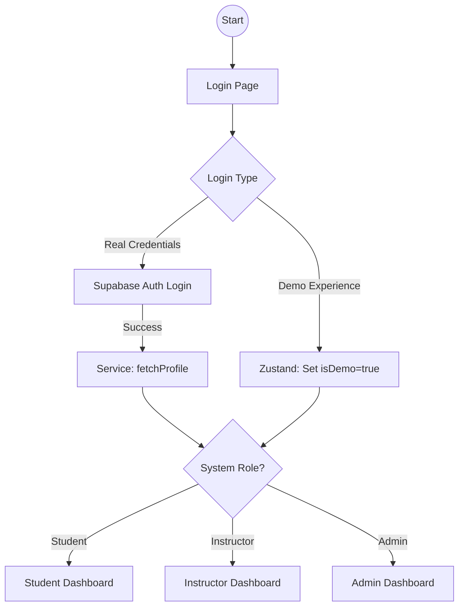
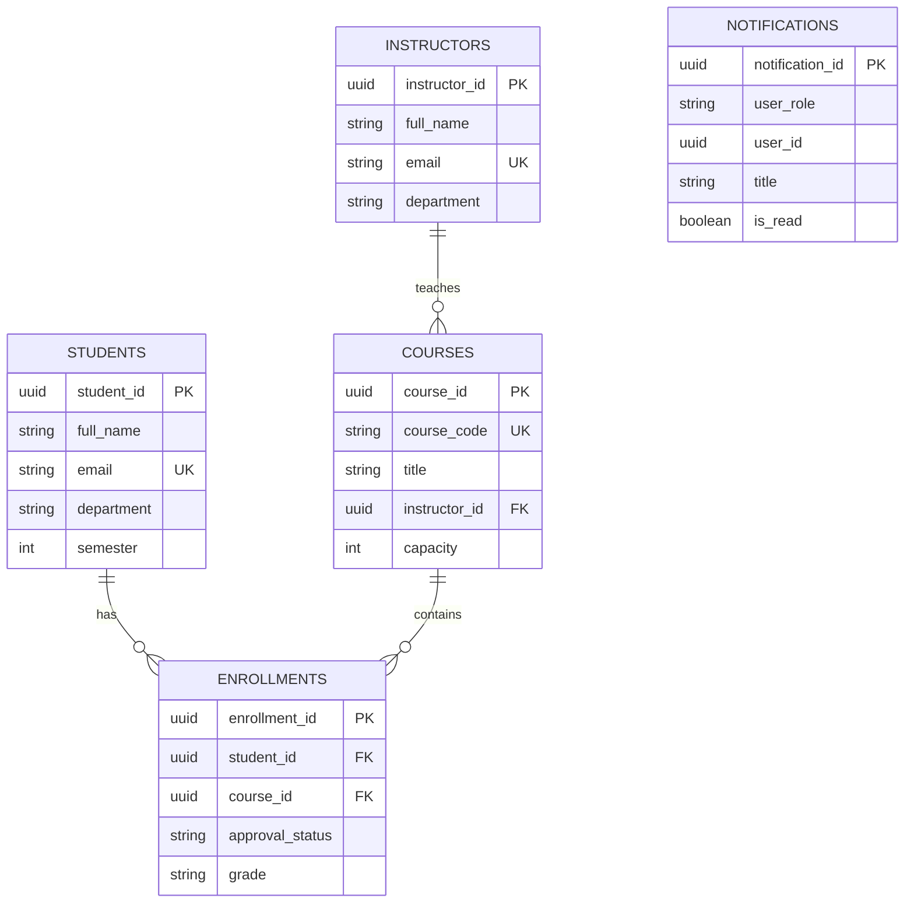

# EduManage: Student Registration & Grade Management System

A sophisticated, multi-role academic management platform built with **React 18**, **Vite**, and **Supabase**. EduManage streamlines the synchronization between students, instructors, and administrators with real-time notifications and a unique dual-mode testing experience.

## 🚀 Key Features

- **Multi-Role Dashboards**: Tailored experiences for Students, Instructors, and Administrators.
- **Dual-Mode Experience**:
    - **Live Mode**: Real-time interaction with a Supabase PostgreSQL backend.
    - **Demo Mode**: Instant access via pre-configured mock data for quick walkthroughs.
- **Automated Workflows**: 
    - Automatic notifications for instructors on new enrollments.
    - Automatic notifications for students on approval/rejection status.
- **Grade Management**: Simplified grading interface for instructors with built-in database constraints for academic integrity.
- **Comprehensive Reporting**: Admin insights into student performance, instructor workload, and enrollment trends.

---

## 🏗️ Technical Architecture

The application follows a clean, branched service architecture that toggles between live network requests and in-memory mock data based on the user's authentication state.



---

## 🔐 Authentication & Role Flow

EduManage handles complex role-based access control (RBAC) by synchronizing Supabase Auth with custom profile tables.



---

## 📊 Database Schema (ERD)

The database is built on PostgreSQL with a focus on relational integrity and automated logging.



---

## 🛠️ Setup & Installation

### 1. Environment Configuration
Create a `.env.local` file in the root directory:
```env
VITE_SUPABASE_URL=YOUR_SUPABASE_URL
VITE_SUPABASE_ANON_KEY=YOUR_SUPABASE_ANON_KEY
```

### 2. Database Initialization
Run the following scripts in your Supabase SQL Editor in order:
1.  `sql_scripts/script1.sql`: Core schema and tables.
2.  `sql_scripts/fix_grade_constraint.sql`: Expanded grade support (A- to D+).
3.  `sql_scripts/add_notification_trigger.sql`: Automation for instructor/student alerts.
4.  `sql_scripts/reset_and_seed.sql`: (Optional) Wipe and seed with 30 test accounts.

### 3. Frontend Setup
```bash
npm install
npm run dev
```

---

## 📁 Project Structure

- `src/services/`: Core business logic and database interaction layer.
- `src/stores/`: Zustand state management for Auth and UI state.
- `src/lib/`: Shared utilities, mappings, and mock data.
- `sql_scripts/`: Production-ready SQL for Supabase setup.

---

## 👥 Contributors
- **Prayatshu Misra** - Project Lead & Architect

---
© 2026 EduManage Academic Systems. All Rights Reserved.
